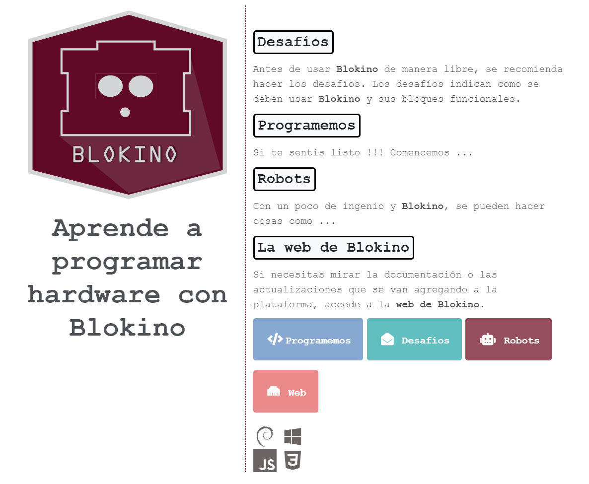
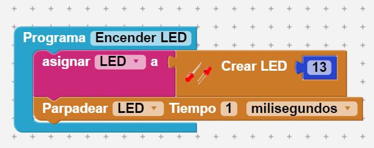
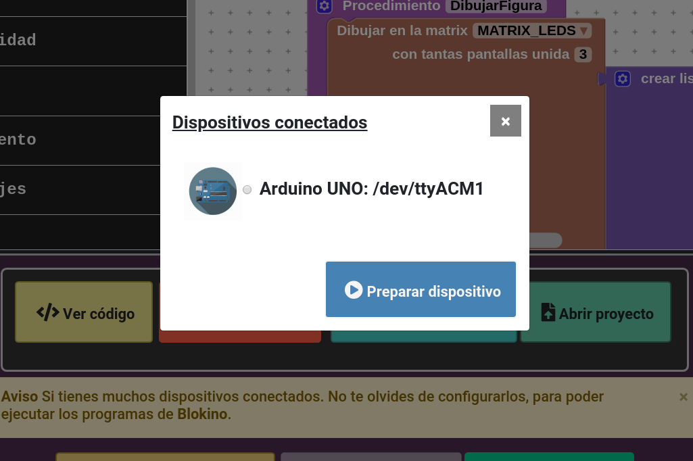
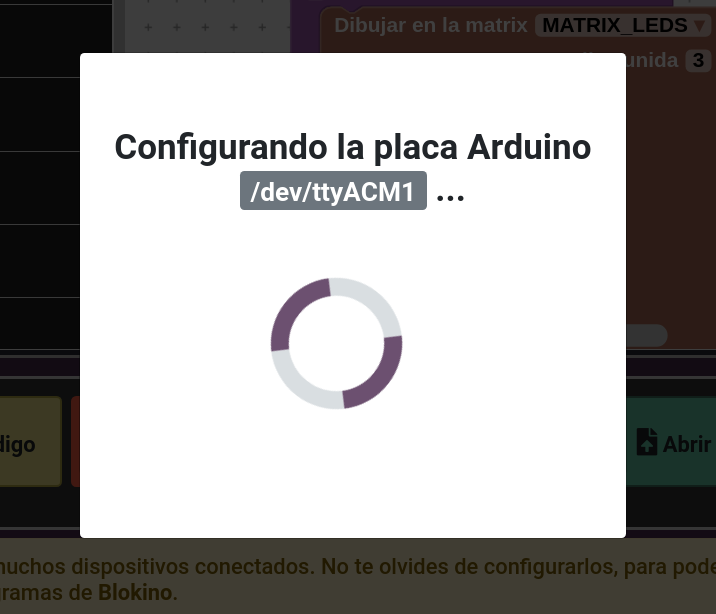
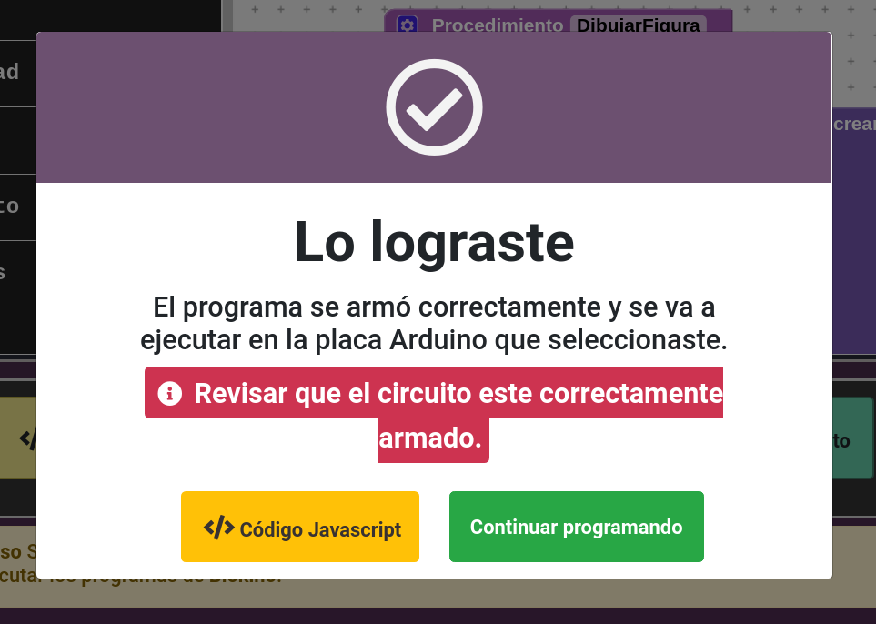

# BLOKINO - Plataforma para programar objetos físicos con Javascript

**Blokino** es un entorno de programación basado en un paradigma de bloques funcionales. Los bloques funcionales son el concepto principal dentro de Blokino. Como el nombre lo dice, son contenedores de lógica y funcionalidad intuitiva, que con el nombre que las describe se entiende que se quiere realizar. Para generar aplicaciones Blokino, se deben ir agrupando estos bloques. Por el momento solo se tiene soporte para las placas Arduino UNO, MEGA y NANO.


### **Composición**

Para el diseño de la plataforma se usaron las siguientes librerías y frameworks:

-   Electron 4.2.0
-   React 16.0.1
-   NodeJS 12.0
-   Johnny-Five 1.3.1

### **Requisitos**

Entre las dependencias generales:

- NodeJS 8 o superiores.
- Yarn
- Arduino IDE

La versión 1.0 de **Blokino** tiene dependencias dependiendo de la plataforma:

-   **Windows**: Desde el lado del hardware, la arquitectura soportada es **Windows 10 - 64bits**. Y desde el lado de software se debe instalar los siguientes programas: - [**Arduino IDE for Windows**](h - **AVR installer ** - Esta incluido en el .zip, que se baja con la plataforma.
-   **Linux**: Para linux se encuentra una sección, dentro la plataforma para instalar dependencias.

### **Como usar localmente**

Para poder configurar localemnte Blokino, se deben ejecutar los siguientes scripts:

-   **git clone -b develop repo**
-   Posicionarse en la carpeta root y ejecutar:
    **npm i** o **yarn install**
-   npm run start
-   Si se produce un conflicto de dependencias, ejecute el siguiente comando:
    **npm run electron-fix-dependencies**
    o
    **yarn run electron-fix-dependencies**
-   En el caso de que no se genere ningún conflicto se debería ver así.



### **Como generar instaladores locales de Blokino**

En el caso que se quiera generar instaladores locales, para ver si algún cambio se realizó correctamente y funciona en la plataforma donde se este usando **Blokino**, se debe ejecutar el siguiente comando:
**npm run eletron-create-installers**
o
**yarn run eletron-create-installers**

En el caso de que la consola interprete dispare un error elecutar el siguiente comando para arreglarlo: **npm run electron-fix-dependencies**
### **Como crear programas con Blokino**

Para poder hacer las aplicaciones Blokino, se deben crear variables y asignarlas a algun bloque funcional con su/s correspondiente/s números de cables dupont. Luego se deben seleccionar las funciones que se quieren realizar con esos componentes electrónicos. Cada bloque funcional hace referencia a componentes electrónicos, funciones, variables declaradas, estructuras de control y mensajes informativos entre otros.

En el siguiente ejemplo, se hace un clasico "Hola Mundo" usando un LED. Los "Hola Mundo" en Arduino es hacer parpader un LED que esta conectada a la placa Arduino. Para hacer el parpadeo de un led, se deben hacer las siguientes acciones:

-   Crear la variable LED.
-   Usar el bloque funcional **Crear LED**, y asignar el número dupont que en este caso es 13.
-   Usar el bloque funcional **Parpadear ... tiempo ...**, donde se debe seleccionar el **LED** creado y asignar un tiempo en el cual se quiere hacer parpadear el LED como así también el grado en milisegundos, segundo o minutos.

Luego de realizar todos los pasos necesarios, tu programa se debería ver de la siguiente manera:



El código **Javascript**, que es generado con el programa es el siguiente:

```
let LED;
LED = (new five.Led({
    pin: 13,
    custom: {
        type: 'LED',
        blink: 0
    }
}));
LED.blink(100);

```

#### **Como ejecutar programas en Blokino**

Para poder realizar la ejecución de los programas de **Blokino**, se debe seleccionar el dispositivo Arduino y configurarlo.



La configuración puede tardar entre 1 o 3 minutos.



Luego de configurarlo se puede ejecutar el programa. El siguiente modal muesta las opciones que se tiene previamente a la eejcución:


Si todo sale correctamente se debería mostrar el modal de exitó


